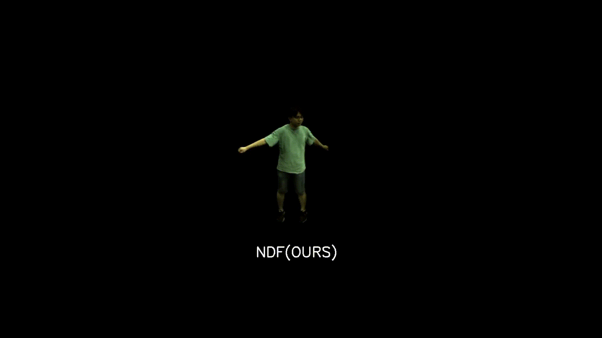
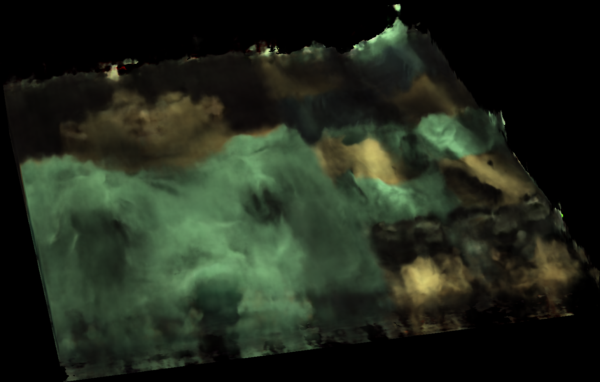

# NDF: Neural Deformable Fields for Dynamic Human Modelling

> [NDF: Neural Deformable Fields for Dynamic Human Modelling]  
> Ruiqi Zhang, Jie Chen  
> ECCV 2022

This is the official implementation of NDF published at ECCV2022. The proposed method is able to conduct novel view synthesis and novel pose synthesis given the multi-view video observation. The above figure shows the dynamics related to changing poses. The code is implemented in pytorch and run on CentOS 7.7.

The learned rendering in observation space:



The learned rendering in NDF space:



## Installation

### Configure Environment

```
conda create -n ndf_release python=3.7
conda activate ndf_release
pip install -r requirement.txt

# install blender for python
wget https://github.com/TylerGubala/blenderpy/releases/download/v2.91a0/bpy-2.91a0-cp37-cp37m-manylinux2014_x86_64.whl
pip install bpy-2.91a0-cp37-cp37m-manylinux2014_x86_64.whl
bpy_post_install

# install pyembree to accelerate trimesh
conda install -c conda-forge pyembree
```

### Download SMPL model

Download SMPL UV from [here](https://download.is.tue.mpg.de/download.php?domain=smpl&sfile=smpl_uv_20200910.zip) and put it at `data/smpl_uv_20200910/smpl_uv.obj`.

### Download ZJU-MoCap Data

Download ZJU-Mocap dataset from [here](https://github.com/zju3dv/neuralbody/blob/master/INSTALL.md#zju-mocap-dataset) and put it to `data/zju_mocap/CoreView_313`.


## Run the code on ZJU-MoCap

We use subject 313 as a running example.


### Data pre-processing

We need to find the UV coordinate for each projected point. This can be done on-the-fly but to save time we pre-process all the transformation matrixs from SMPL surface in 3D to UV coordinate in UV space.

```
python tools/createDataset.py
```


### Pre-trained model

Download latest.pth from [here](https://drive.google.com/file/d/1vJPUbZWnK-_SWAwVcwF6RCNGp56_J8E1/view?usp=sharing) and put it at `data/trained_model/if_nerf/ndf_313/latest.pth`.
Then run 
```
sh run_train_test_fid.sh 60 False
```

The evaluation result is expected to be
```
# novel view synthesis
mse: 0.0011499698173650414
psnr: 29.927725532762025
ssim: 0.9683078237882652

# novel pose synthesis
mse: 0.005014139546091728
psnr: 23.463418908827254
ssim: 0.9039105207522721
```

### Train from scratch and test

We train the model on a single V100 GPU. It consumes about 20 hours to finish the training.

```
export exp_name=ndf_313
sh run_train_test_fid.sh 60 False
```

## Acknowledgement

The implementation took reference from [Neural Body](https://github.com/zju3dv/neuralbody). We thank the authors for their generosity to release code and data.
